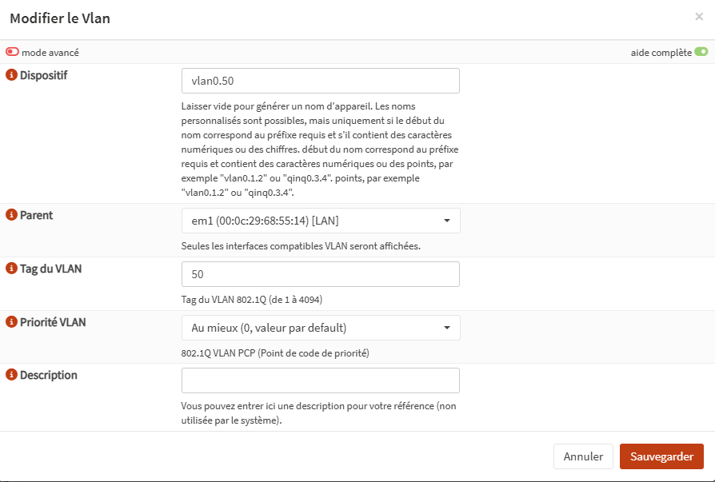
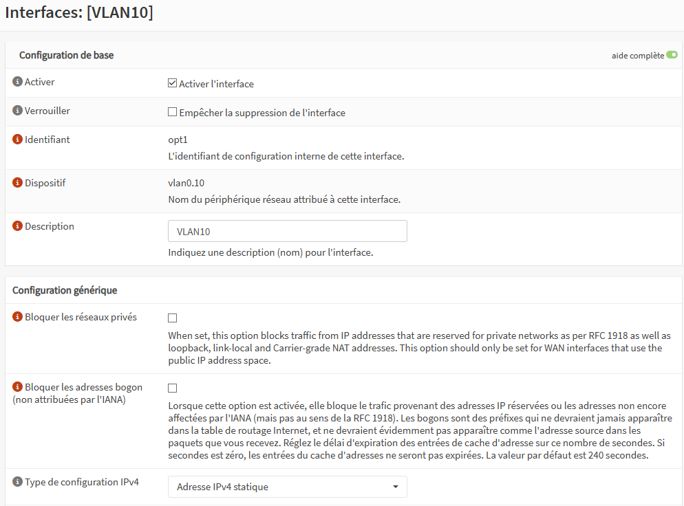
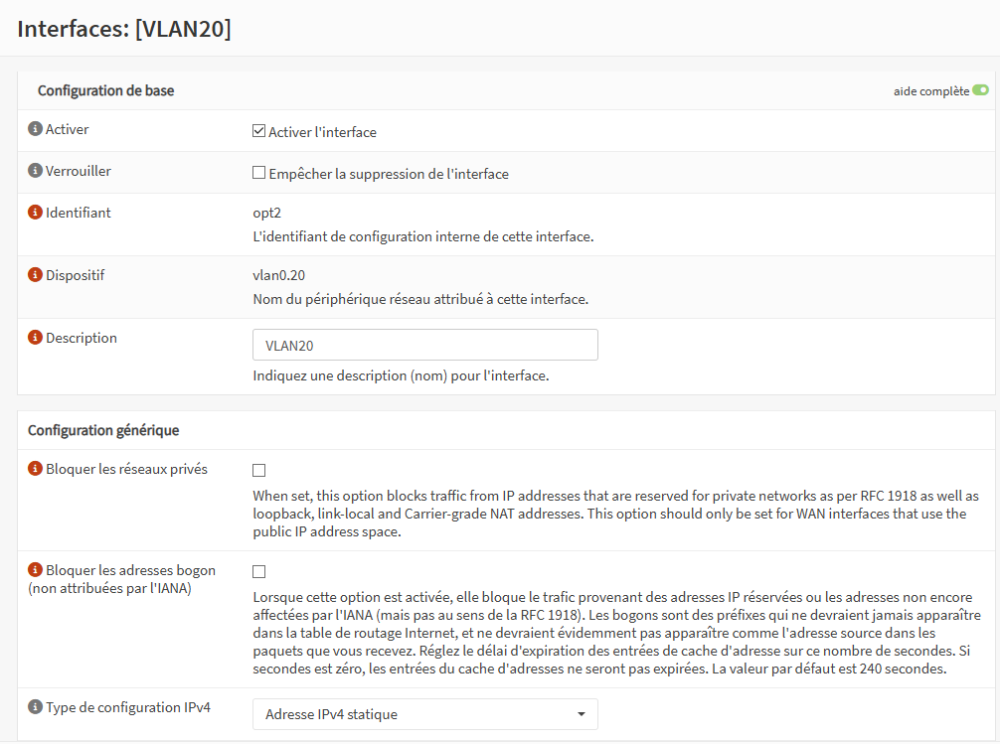
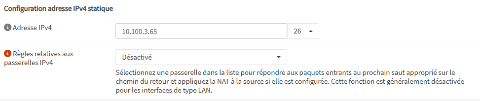
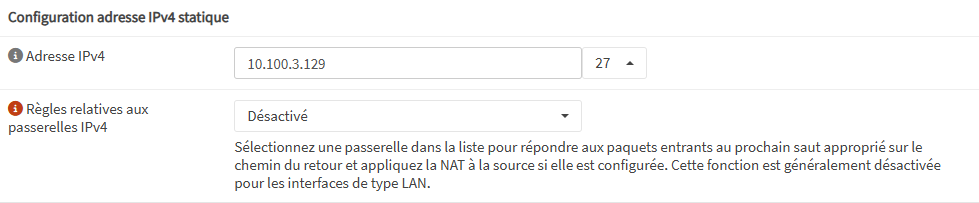
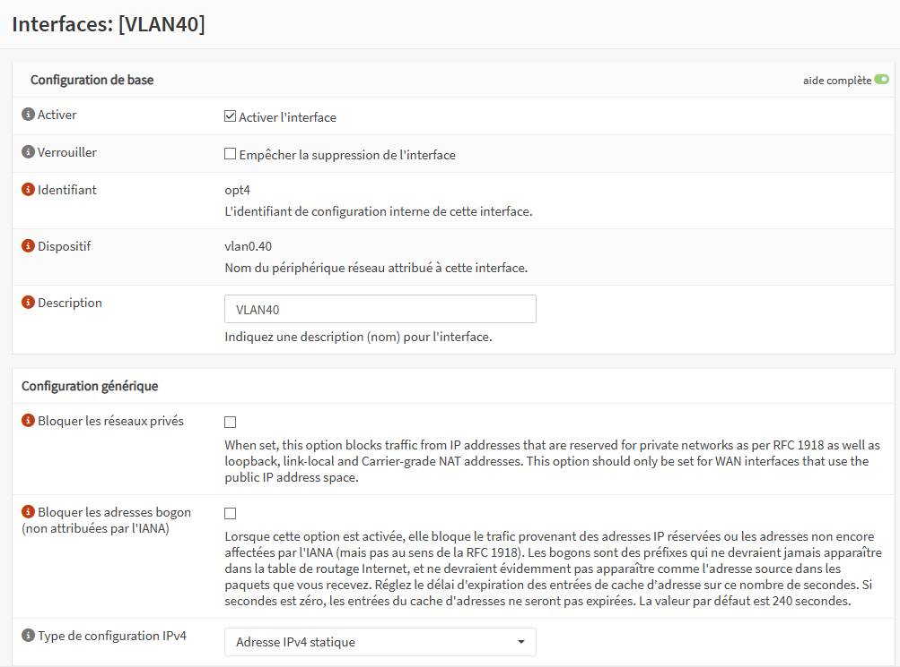
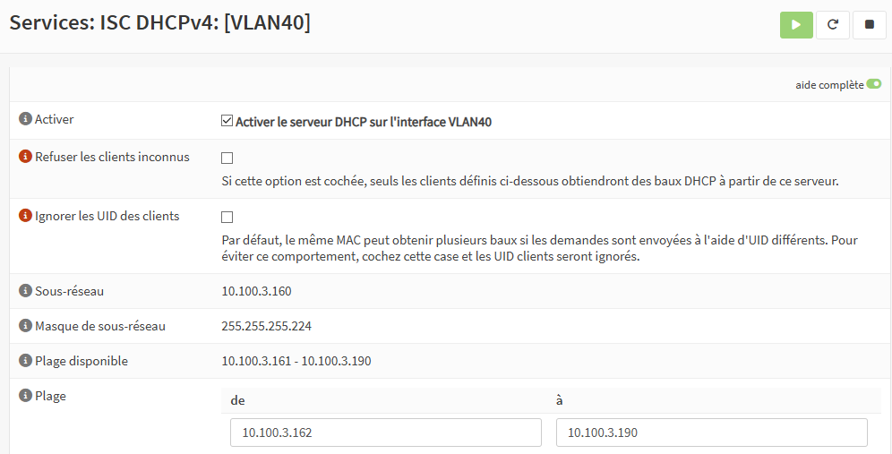
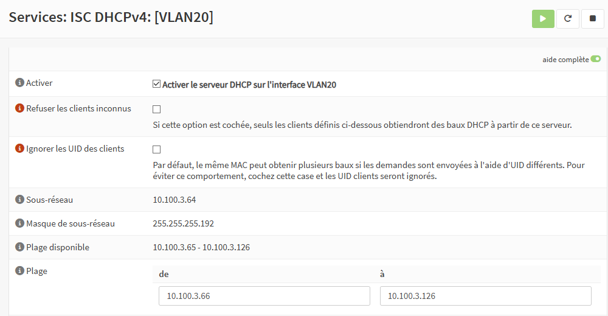
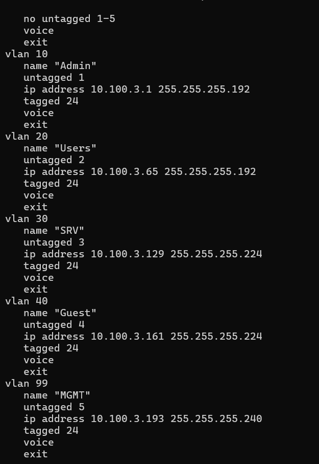

# RUNBOOK : 

#### Projet : 
**Rénovation & pérennisation du réseau « Grand Ouest »**
#### Groupe : 
**R&D (Groupe 3)**
VITROU Vladimir / BRAUD Thomas / CAILLAUD Nino / MOLENDI Lucas / BROSSET Lilian / ALBERTEAU Théotim
#### Date : 
**13/01/2026 - 26/01/2026**

## 1. Conventions et inventaire : 

### 1.1 Equipements :

 - Routeur Cisco : ` TTB-G3-RTR `
 - Pare-feu OPNsense : ` TTB-G3-FW `
 - Client de test : `TTB-G3-CLI-USR`

### 1.2 Tableau d'adressage IP : 

#### **Adresses Principales**
| Nom         | IPv4           | IPV6                 | Description        |
| ----------- | -------------- | -------------------- | ------------------ |
| Adresse WAN | 172.16.0.0/24  | -                    | (imposé)           |
| G3 R&D      | 172.16.0.13/24 | 2001:db8:0:16::13/64 | Adresse  WAN Perso |
 
#### **BLOC LAN**

| Zone    | VLAN | IPv4            | Passerelle   | Usage                                 |
| ------- | ---- | --------------- | ------------ | ------------------------------------- |
| ADMIN   | 10   | 10.100.3.1/26   | 10.100.3.62  | Gestion d'équipements (HTTPS/SSH)     |
| USERS   | 20   | 10.100.3.65/26  | 10.100.3.126 | Postes de Travails R&D                |
| SRV     | 30   | 10.100.3.129/27 | 10.100.3.158 | Données sensibles / Prototypes        |
| GUEST   | 40   | 10.100.3.161/27 | 10.100.3.190 | Partenaires externes (Web uniquement) |
| MGMT    | 99   | 10.100.3.193    | 10.100.3.206 |                                       |
| TRANSIT | -    | 10.255.3.0/30   | -            | Lien Routeur <-> Firewall             |

Voir **5.1 Photo de l'adressage IP des VLAN**

#### **Réseaux de transit**

| Nom               | IPv4          | IPV6                |
| ----------------- | ------------- | ------------------- |
| Transit           | 10.255.3.0/30 | 2001:db8:3:ff::/64  |
| Routeur (Transit) | 10.255.3.1/30 | 2001:db8:3:ff::1/64 |
| OPNsense (WAN)    | 10.255.3.2/30 | 2001:db8:3:ff::2/64 |

### 1.3 Schéma du Réseau 

## 2. Procédures d'Exploitation (MCO) : 

### 2.1 Sauvegardes des configs 

#### 2.1.1 Routeur :
	-  Se connecter en SSH en admin au Routeur : 
`ssh admin@10.255.3.1`

	- Exécuter 
` copy running-config startup-config`

	- Copier le texte dans un fichier .txt daté le contenu de  
` show running-config` 

#### 2.1.2 OPNsense : 
	- Aller sur l'interface Web (VLAN 10)
`https://10.100.3.1`

	- Menu : **System > Configuration > Backups**
	- Télécharger le fichier 
` .xml `

#### Interface du routeur/firewall OPNsense

### 2.2 Création et configuration des VLANS

#### Exemple de création d'une VLAN 

#### 2.2.1 VLAN 10 : 

#### 2.2.2 VLAN 20 :

#### 2.2.3 VLAN 30 : 

#### 2.2.4 VLAN 40 : 

#### 2.2.5 Configuration sur le switch
Voir annexes **5.4 Configuration des VLANs sur le switch**

### 2.3 Configuration des Firewalls des VLANS

Voir aussi l'annexe **5.2 Configuration firewall OPNsense** et **5.3 Configuration DHCPv4 du Firewall**
#### 2.3.1 VLAN 10 

#### 2.3.2 VLAN 20

#### 2.3.3 VLAN 30

#### 2.3.4 VLAN 40

### 2.4 Configuration des DHCPv4 des VLANS 

#### 2.4.1 VLAN 10 

#### 2.4.2 VLAN 20 

#### 2.4.3 VLAN 30

#### VLAN 40

### 2.5 Ajout de VMS sur la VLAN Users

#### 2.5.1 ESXi 

- Assigner la carte réseau de la VM au *Port Group* `VLAN20_USERS`
#### 2.5.2 OPNsense (DHCP)
- Vérifier que la VM reçoit une IP dans la plage `10.100.3.66 - 10.100.3.126`
#### 2.5.3 OPNsense (Firewall)
- Si la VM a besoin d'un flux spécifique, créer une règle dans **Firewall > Rules > VLAN20_USERS**

### 2.6 Restauration de configs

#### 2.6.1 Routeur

	En cas d'erreur du routeur :
- Si la connectivité est perdue, redémarrer le routeur sans sauvegarder (`reload`) pour revenir à la `startup-config`

#### 2.6.2 OPNsense

	En cas d'erreur de config OPNsense
- Utiliser la console ESXi pour restaurer une version précédente de la configuration via le menu local ou importer le dernier `.xml` fonctionnel

#### 2.6.3 ESXi

- Utiliser les snapshots avant toute modification majeure sur les VMs serveurs ou Firewall

## 3. Checklists de Diagnostic 

### 3.1 DHCP KO

- **Symptôme :** Le client a une IP en `169.254.x.x` ou `0.0.0.0`.
    
- **Action :** Sur OPNsense, vérifier `Services > DHCPv4 > [Interface]` et redémarrer le service si "Stopped".
    
- **Vérification :** Consulter l'onglet `Leases` pour confirmer l'attribution d'une IP à l'adresse MAC du client.

### 3.2 DNS KO

- **Symptôme :** `ping 8.8.8.8` fonctionne, mais `ping google.fr` échoue.
    
- **Action :** Vérifier `Services > DNS Resolver` sur OPNsense et l'autorisation du port **UDP/53** dans les règles Firewall.
    
- **Vérification :** La commande `nslookup intranet.ttb.local` doit retourner l'IP du serveur G2.

### 3.3 Pas d'accès inter-division

-  **Symptôme :** Impossible de joindre un service dans une autre division (ex: G1 ou G2).
    
- **Action :** Vérifier la table de routage Cisco (`show ip route`) et les logs **WAN** d'OPNsense (blocage entrant/sortant).
    
- **Vérification :** Le `ping` vers l'IP WAN d'une autre division (ex: `172.16.0.11`) doit répondre.

### 3.4 Internet KO

- **Symptôme :** Aucun accès aux ressources externes (Web, Mises à jour).
    
- **Action :** Vérifier le **NAT Outbound** (Mode Hybrid) et la route par défaut d'OPNsense vers le Cisco (`10.255.3.1`).
    
- **Vérification :** Un `traceroute 8.8.8.8` doit montrer le saut par OPNsense (`.2`) puis par le Routeur (`.1`).

### 3.5 VM Sur mauvais réseau ESXi

- **Symptôme :** La VM a une IP en `169.254.x.x` ou ne ping même pas sa propre passerelle.
    
- **Action :** Dans vSphere, modifier les paramètres de la VM -> Network Adapter -> Sélectionner le Port Group correspondant au VLAN (ex: `VLAN30_SRV`).
    
- **Vérification Trunk :** Le Port Group "TRUNK" vers OPNsense est-il bien en **VLAN ID 4095** (mode promiscuous/trunk sur ESXi) ?

## 4. Points de contrôles et Retours d'expériences

### 4.1 Points de contrôles du projet

| **Point de contrôle**   | **Outil / Commande**                  | **Résultat attendu**                                                   | **Effectué** |
| ----------------------- | ------------------------------------- | ---------------------------------------------------------------------- | ------------ |
| **Interfaces Routeur**  | `show ip int brief`                   | Toutes les interfaces (WAN et Transit) sont `up/up`.                   | ☑            |
| **Interfaces Firewall** | Dashboard OPNsense                    | WAN, VLAN10, 20, 30, 40 sont vertes (Flèche vers le haut).             | ☑            |
| **Service DHCP**        | `Services > DHCPv4 > Leases`          | Présence de baux actifs pour les clients USERS.                        | ☑            |
| **Service DNS**         | `Services > DNS Resolver > Reporting` | Le service répond aux requêtes locales.                                | ☑            |
| **NAT Sortant**         | `Firewall > NAT > Outbound`           | Mode "Hybrid" ou "Manual" avec règle pour `10.100.3.0/24` vers le WAN. | ☑            |
| **Logs Firewall**       | `Firewall > Log Files > Live`         | Pas de blocage massif anormal (Rouge) sur des flux métiers.            | ☑            |
| **Sauvegardes**         | `System > Configuration > History`    | Une sauvegarde automatique ou manuelle existe pour chaque changement.  | ☑            |

### 4.2 Problèmes
#### *Pour nos retours personnels, nous avons eu plusieurs problèmes importants :*
- Oubli d'une **sauvegarde** ce qui nous a fait recommencer l'ensemble de la configuration. 
- Un problème d'IP, celle de la config VLAN à été remplacée par la **passerelle**, ce qui empêchait le bon fonctionnement.

### 4.3 Réussites 

#### *Mais ces échecs ont suivis de réussites :*
- Un utilisateur et le routeur visibles dans la VLAN (voir annexe **5.5 Utilisateur et routeur dans la VLAN**)

## 5. Annexes :

### 5.1 Photo de l'adressage IP des VLAN

### 5.2 Configuration firewall OPNsense

### 5.3 Config DHCPv4 du Firewall

### 5.4 Configuration des VLANs sur le switch

### 5.5 Utilisateur et routeur dans la vlan

