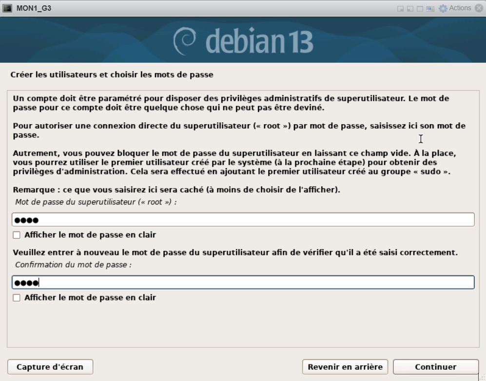
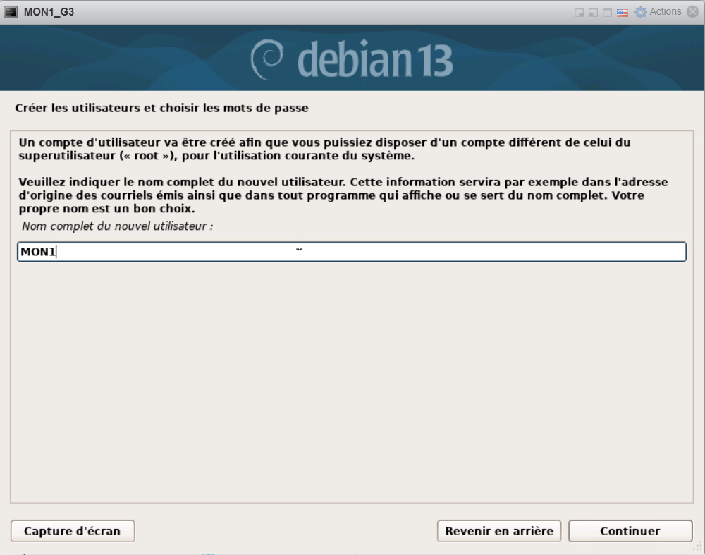
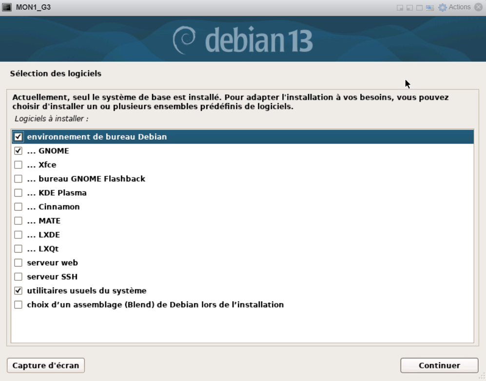

# Prérequis  
Pour installer Graphana et GLPI, il faut faire 2 VM Debian 13 ou tout autre OS Linux. 

### Installation Debian 13
- Choisir Interface Graphique  

  

- Nommer la machine (ici celle de Graphana)  

  

- Sélection du mot de passe root et du nom d'une session utilisateur  

  

- Partionner le(s) disque(s)  
  
  

- Sélection des logiciels, puis on termine l'installation 

## Graphana (theotim a faire)  

## GLPI

