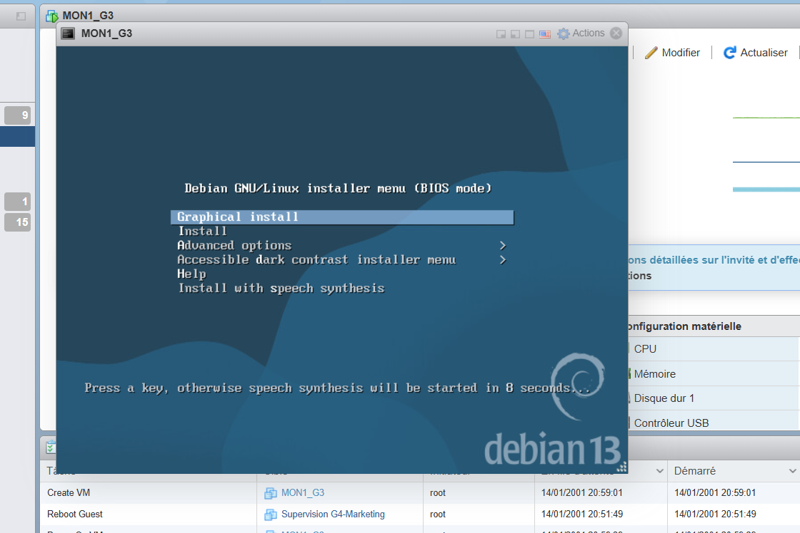

# Prérequis  
Pour installer Graphana et GLPI, il faut faire 2 VM Debian 13 ou tout autre OS Linux. 

## Groupe : 
**R&D (Groupe 3)**
VITROU Vladimir / BRAUD Thomas / CAILLAUD Nino / MOLENDI Lucas / BROSSET Lilian / ALBERTEAU Théotim  

## Date : 
**26/01/2026 - 30/01/2026**

### Installation Debian 13
- Choisir Interface Graphique  

  

- Nommer la machine (ici celle de Graphana)  

  

- Sélection du mot de passe root et du nom d'une session utilisateur  

  

- Partionner le(s) disque(s)  
  
  

- Sélection des logiciels, puis on termine l'installation 

## Graphana (theotim a faire)  

## GLPI  
Pour l'installation de GLPI nous avons suivi ce tutoriel d'IT-Connect : [Tutoriel](https://www.it-connect.fr/installation-pas-a-pas-de-glpi-10-sur-debian-12/)  
 
- Nous avons chosi comme version de GLPI la : glpi-11.0.5 et comme nom de domaine groupe.trois.fr

